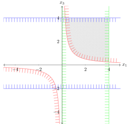

# Formulating the Crop Yield problem using QUBO and solving it using VQE and QAOA approach

Quantum Computing has the potential to revolutionize computing, as it can solve problems that are not possible to solve on a classical computer. This extra ability that quantum computers have is called quantum advantage. To achieve this goal, the world needs passionate and competent end-users: those who know how to apply the technology to their field.

## Crop-Yield Problem as a Quadratic Problem

To show how to solve your quadratic program using a quantum computer, we will use two algorithms to solve the crop-yield problem. It is a common need to optimize the crops and management of a farm to reduce risk while increasing profits. One of the big challenges is how to produce enough food for everyone. The problem here focuses not on profits but on the tonnage of crops harvested. Imagine you have a farm with three hectares of land suitable for farming. You need to choose which crops to plant from a selection of four. Furthermore, you also need to determine how many hectares of each you should plant. The four crops you can plant are wheat, soybeans, maize, and a push-pull crop. The fourth cannot be sold once harvested but it can help increase the yield of the other crops.

<table>
    <tr>
        <th>
            
        </th>
    </tr>
    <tr>
        <th>
            Our beautiful three hectare farm
        </th>
    </tr>
</table>

<table>
    <tr>
        <th>
        
        </th>
        <th>
            
        </th>
        <th>
            
        </th>
        <th>
            
        </th>
    </tr>
    <tr>
        <th>
            Wheat
        </th>
        <th>
            Soybeans
        </th>
        <th>
            Maize
        </th>
        <th>
            Push-Pull
        </th>
<!--         <th>
            
Wheat

        </th>
        <th>
            
Soybeans

        </th>
        <th>
            
Maize

        </th>
        <th>
            
Push-Pull

        </th> -->
    </tr>
</table>

There are three types of farming methods we can use: monocropping, intercropping, and push-pull farming. These are shown below. Monocropping is where only one crop is farmed. This is can make the farm susceptible to disease and pests as the entire yield would be affected. In some instances, growing two different plants nearby each other will increase the yield of both, though sometimes it can decrease the yield. Intercropping is the process where different plants are chosen to _increase_ the yield. Push-Pull crops are pairs of plants that repel pests and attract pests respectively. Integrating them into a larger farm increases the yield of harvested food but with the cost of not necessarily being able to use the harvest of Push-Pull crops as part of the total yield. This is because the Push-Pull crop may not be usable or even edible.

<table>
    <tr>
        <th>
            
        </th>
        <th>
            
        </th>
        <th>
            
        </th>
    </tr>
    <tr>
        <th>
            Monocropping
        </th>
        <th>
            Intercropping
        </th>
        <th>
            Push-Pull farming
        </th>
    </tr>
</table>

---
Only in certain cases can quadratic programming problems be solved easily using classical problems. In their general sense, they are NP-Hard; a class of problems that is difficult to solve using classical computational methods. In fact, the best classical method to solve these problems involves heuristics, a technique that finds an approximate solution. Quantum Computers have been shown to provide significant speed-up and better scaling for some heuristic problems. The crop-yield problem is a combinatorial problem, in that the solution is a specific combination of input parameters. Though the problem shown here is small enough to solve classically, larger problems become intractable on a classical computer owing to the number of combinations of which to optimize.

Solving the above problem using quantum computing involves three components:

1. Defining the problem
2. Defining the algorithm
3. Executing the algorithm on a backend

Many problems in Qiskit follow this structure as the algorithm you use can typically be swapped for another without significantly redefining your problem.

----

Shown above is a visualization of a solution to a typical quadratic Optimization problem. 
